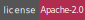

[][homepage]

====

# StructBX

## Introduction

Hello! Thank you for using this software, developed with a lot of effort and affection for the Free Software community.

## About this software

StructBX is a collaboration tool that combines the ease of use of a spreadsheet with the power of a database.

## Documentation

**Work in progress!**

## Contact

- **Github**: [@structbx](https://github.com/structbx/)
- **Web**: [StructBX](https://structbx.github.io/)

## License

This project is under licence [Apache-2.0](http://www.apache.org/licenses/LICENSE-2.0) - see file [LICENSE](LICENSE) for more details

[homepage]: https://structbx.github.io/
[compilers_versions]: https://en.cppreference.com/w/cpp/compiler_support